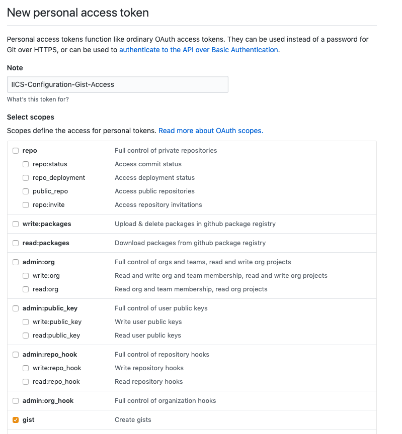
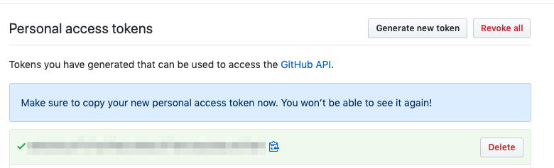
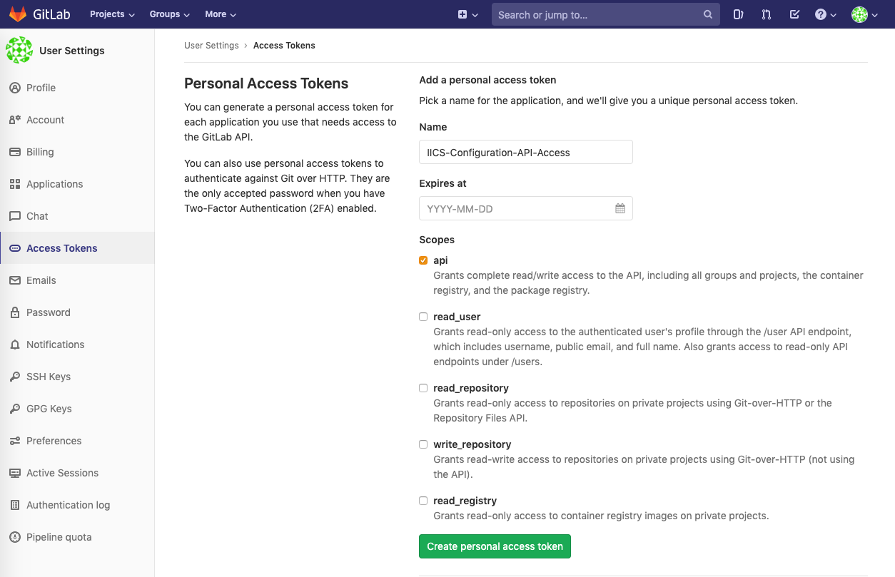

# Informatica Cloud IPS Baseline Bundle

This project contains set of re-usable IICS Designs SDLC utilities, examples and documentations

<!-- TOC -->

- [Informatica Cloud IPS Baseline Bundle](#informatica-cloud-ips-baseline-bundle)
  - [Provided Assets](#provided-assets)
  - [Before You Start](#before-you-start)
  - [Install The Bundle](#install-the-bundle)
    - [Build from Source](#build-from-source)
    - [Use pre-built binaries](#use-pre-built-binaries)
  - [Configure Individual Components](#configure-individual-components)
  - [Connectors and Connections](#connectors-and-connections)
    - [AgentFileWriter](#agentfilewriter)
    - [DataAccessService](#dataaccessservice)
    - [Email](#email)
    - [github-gist](#github-gist)
      - [Setup GitHub Gist Account and Access Token](#setup-github-gist-account-and-access-token)
    - [gitlab-snippets](#gitlab-snippets)
      - [Setup GitLab Account and Access Token](#setup-gitlab-account-and-access-token)
    - [ICS-API](#ics-api)
    - [IPaaS-Configuration-DB](#ipaas-configuration-db)
    - [IPaaS-Logging](#ipaas-logging)
  - [Processes](#processes)
  - [Glossary of Terms used in this Documents](#glossary-of-terms-used-in-this-documents)

<!-- /TOC -->

## Provided Assets

- [Logging Framework](doc/logging_framework.md)
- [Administration and Development Support Guides](doc/guides.md)
- [Process Templates and Examples](doc/templates.md)
- [Asset Management Scripts](doc/build.md) to export, import, publish and Version Control IPD Designs Implemented as Apache Ant Scripts
- Integration with other SDLC Assisting Tools ([Migration/Transformation Tool](https://github.com/jbrazda/icai-migration-tools), [IICS Reporting Tool](https://github.com/jbrazda/iics-reporting-tools))
- Best practices and Other Integration use case Examples
  - [Naming Conventions](https://github.com/jbrazda/Informatica/blob/master/Guides/InformaticaCloud/naming_conventions.md)
  - [How to Setup Your Development Environment](https://github.com/jbrazda/Informatica/blob/master/Guides/InformaticaCloud/set_development_environment.md)

## Before You Start

- **Read the provided documentation**
- This bundle is continuously developed and improved, feel free to subscribe and monitor updates that might be useful for you in the future
- This bundle is not officially supported by Informatica, please report any issues you find via Github issues report
- Do not or move imported assets Project/Folder Locations after import, this would make updates much more difficult
- You can update or change imported resources to adjust them for your needs but keep in mind that it would be your responsibility to merge or maintain any changes you have made to provided designs
- Any of the provided assets can significantly re-designed or removed in the future releases

## Install The Bundle

### Build from Source

This should be the preferred method to build this package from source and deploy following a generic guide to use provided [Asset Management Scripts](doc/build.md)

### Use pre-built binaries

Using pre-build packages is easy but has some down-sides such as need to adjust a lot environment specific parameters after import i.e. Deployment targets for Connections and Processes
Use build from source method which allows you to automate these adjustments in bulk using a declarative configuration and set of provided scripts

1. Download pre built Distribution from [Releases]
   1. Use [ICAI-IPS-Bundle_InitialInstall_All_Designs.zip](https://github.com/jbrazda/icai-ips-bundle/releases/latest/download/ICAI-IPS-Bundle_InitialInstall_All_Designs.zip) to initial install
   2. Use [ICAI-IPS-Bundle_Update_Excluding_Connections.zip](https://github.com/jbrazda/icai-ips-bundle/releases/latest/download/ICAI-IPS-Bundle_Update_Excluding_Connections.zip) to update your Bundle in environments whet it was already installed before
2. Import Distribution Package Bundle
3. Configure, adjust and publish provided designs

## Configure Individual Components

## Connectors and Connections

### AgentFileWriter

Design: Explore/Tools/Connections/AgentFileWriter.AI_CONNECTION.xml
Description: Generic file writer allows to stage and upload files on Associated Secure Agent or group of Agents

This connection can be used to write files to Secure agent and is used by the SP-util-upload-agent process
Key Configuration property that might be your secure agent specific is File Connector/EventTargets/Directory
which is configured by default to `/tmp` directory. You also might want to create separate
Connections and corresponding process for each secure agent in case you need to push files to different agents.
Ideally One connection can be used and push of the files is done via any member of agent groups to shared
filesytem mounted to all members of the Secure Agent Group.

### DataAccessService

Design: Explore/DAS/DataAccessService.AI_CONNECTION.xml
Description: DO NOT USE THIS SERVICE DIRECTLY is defined only to provide design time metadata definitions for Automated Steps execSQL and execMultiSQL

To configure this connection, just publish `DataAccessService` Connector and then `DataAccessService` Connection
Then You can publish corresponding Proxy processes (`execMultiSQLProxy`, `execSQLProxy`) that give access to DAS  from Cloud guides and processes

Use `Data Access Services/execMultiSQL` or `Data Access Services/execSQL` to invoke data Access Service automated steps from IPD processes

### Email

Design: Explore/Tools/Connections/Email.AI_CONNECTION.xml
Description: Shared Email Service to send alerts and notifications

Use Email Connection to send email notifications as an activity withing your Integration Processes

### github-gist

Github REST V3 APi to manage Gists
see [GIST API Documentation](https://developer.github.com/v3/gists/)

This connector is useful to store and retrieve configurations, templates, snippets, etc.
See an example of using Gist as a configuration storage provider [Alert Service](https://github.com/jbrazda/icai-fault-alert-service)

#### Setup GitHub Gist Account and Access Token

Make sure your secure agents can access the GitHub API to store and retrieve the Alert Service configuration file.

This Alert Service Implementation can use Github Gist (both Cloud and On premise Github Enterprise Edition) as a storage for its configuration
It is recommended to use private gist to store this configuration, you will need to create Security token to access private gists via API

1. Login to Github with an account that would be owner of the configurations (this should be likely service Account or account managed by IT Infrastructure administrators)
2. Go to [Account Settings/Developer Settings/Personal access tokens](https://github.com/settings/tokens)
3. Create new token and give it descriptive name such as `IICS-Configuration-Gist-Access`
4. Select only gist permission

    

5. Capture generated token and save it in a save location for later use in the Service Connector configuration after Deployment of the IICS package

    

Connector Properties

| Name         | Description                                                                        |
| ------------ | ---------------------------------------------------------------------------------- |
| base_uri     | Base URI of the REST endpoint Base URI of the REST endpoint https://api.github.com |
| access_token | Gist API Access Token                                                              |
| api_version  | API Version (currently V3)                                                         |

### gitlab-snippets

Provides Support to store  and retrieve configurations or other files as GitLab Snippets
See [Gilab API Documentation](https://gitlab.com/help/api/README.md)

#### Setup GitLab Account and Access Token

Make sure your secure agents can access the GitLab API to store and retrieve the Alert Service configuration file.

This Alert Service Implementation can use Cloud Hosted or on-premise GitLab as a storage for its configuration
It is recommended to use private snippets to store this configuration, you will need to create Security token to access private Assets via API

1. Login to GitLab with an account that would be owner of the configurations (this should be likely service Account or account managed by IT Infrastructure administrators)
2. Go to [Account Settings/Access Tokens](https://gitlab.com/profile/personal_access_tokens)
3. Create new token and give it descriptive name such as `IICS-Configuration-API-Access`
4. Optionally set expiration date
5. Select api access permission

    

6. Capture generated Token and use it to configure GitLab Service Connector

Connector Properties

| Name         | Description                                                   |
| ------------ | ------------------------------------------------------------- |
| base_uri     | GitLab API Base URL (example: https://gitlab.example.com/api) |
| access_token | API Access Token                                              |
| api_version  | API Version (currently v4)                                    |

### ICS-API

This service defines actions to connect to IICS through REST API and perform Export/Import and license management activities

### IPaaS-Configuration-DB

Database Used to Store Simple key/value configurations

This Connection provides ability to store configurations in External Database and Guides/processes to manage such configurations

### IPaaS-Logging

Design: Explore/Logging/Connections/IPaaS-Logging.AI_CONNECTION.xml
Description: IPaaS Database for Logging and job tracking

## Processes

## Glossary of Terms used in this Documents

| Term                            | Description                                                                                                                                                        |
| ------------------------------- | ------------------------------------------------------------------------------------------------------------------------------------------------------------------ |
| IICS                            | Informatica Intelligent Cloud Services, Informatica Cloud Integration platform                                                                                     |
| ICAI                            | (formerly ICRT) Informatica Cloud Application Integration, see ICRT                                                                                                |
| ICDI                            | (formerly ICS) Informatica Cloud Data Integration is an ETL batch integration component of IICS platform                                                           |
| BPEL                            | Business Process Execution Language                                                                                                                                |
| BPMN                            | Business Process Modeling Notation                                                                                                                                 |
| WSDL                            | Web Service Definition Language                                                                                                                                    |
| API                             | `Application Programming Interface                                                                                                                                 |
| REST                            | REpresentational State Transfer                                                                                                                                    |
| IPD                             | Informatica Process Designer                                                                                                                                       |
| Application Integration Console | ICAI Cloud and Secure Agent Runtime Administration Tool                                                                                                            |
| Informatica Secure Agent        | Informatica Data Integration Execution Agent that Provides ability to integrate data on premise and in the Cloud, hybrid data integration both batch and real time |
| DAS                             | Data Access Service                                                                                                                                                |
| SDLC                            | Software Development Lifecycle                                                                                                                                     |

[alert_service_help]: https://network.informatica.com/onlinehelp/IICS/prod/CAI/en/index.htm#page/cai-aae-monitor/System_Services.html
[development_setup]: https://github.com/jbrazda/Informatica/blob/master/Guides/InformaticaCloud/set_development_environment.md
[iics_cli]: https://network.informatica.com/docs/DOC-18245
[ipd_install_guide]: https://github.com/jbrazda/Informatica/blob/master/Guides/InformaticaCloud/install_process_developer.md
[iics_urn_mappings]: https://network.informatica.com/onlinehelp/IICS/prod/CAI/en/cai-aae-monitor/URN_Mappings.html
