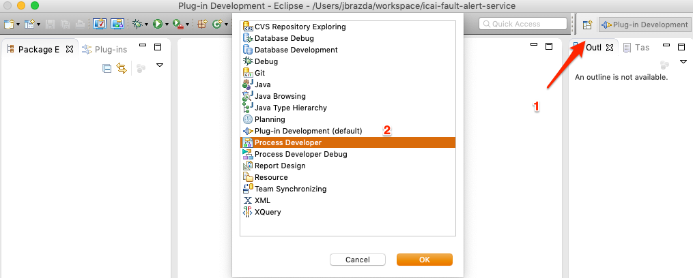
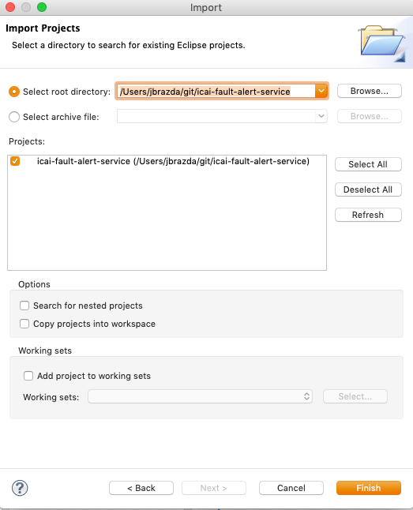
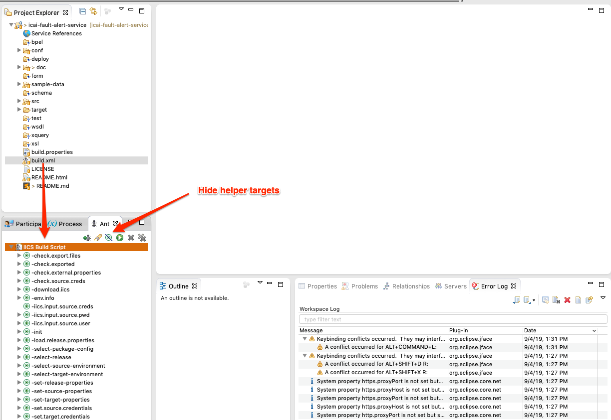
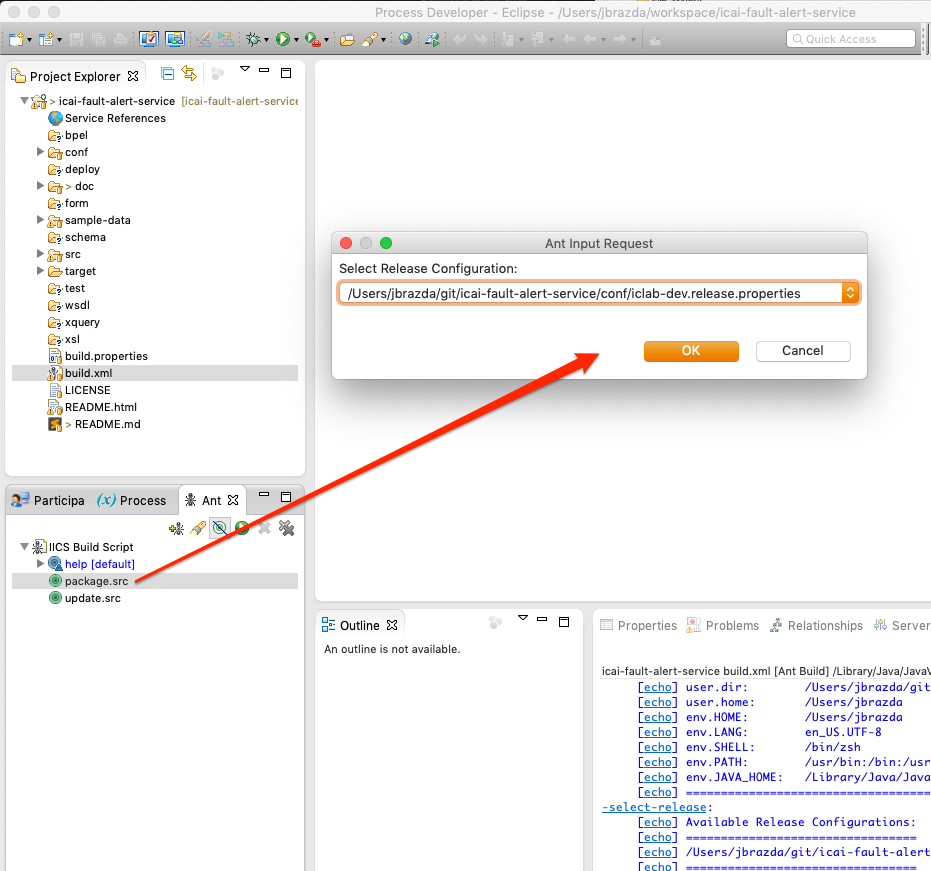
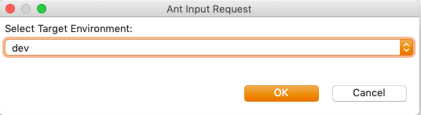
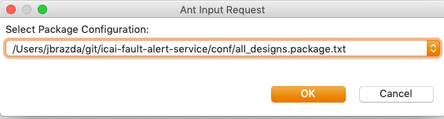

# Automation to Build and Deploy IICS Design Packages

This package contains [Apache Ant Script](../build.xml) to maintain the sources in VCS Repository, build and deploy to target IICS environments

<!-- TOC -->

- [Automation to Build and Deploy IICS Design Packages](#automation-to-build-and-deploy-iics-design-packages)
  - [Pre-Requisites](#pre-requisites)
  - [Inspect and adjust Main build.properties configuration file](#inspect-and-adjust-main-buildproperties-configuration-file)
  - [Configure credentials file](#configure-credentials-file)
    - [Transformation Properties](#transformation-properties)
      - [Example Transformation Properties File](#example-transformation-properties-file)
      - [Main Ant Script Properties](#main-ant-script-properties)
      - [Ant Build Script](#ant-build-script)
    - [Build Package From Source](#build-package-from-source)
      - [In Process Developer](#in-process-developer)
  - [Build Using Command Line](#build-using-command-line)
    - [Package Sources](#package-sources)
    - [Build a full package, DEV Environment Target](#build-a-full-package-dev-environment-target)
  - [Build a Package without Connections DEV Target](#build-a-package-without-connections-dev-target)
    - [Import Package to test environment](#import-package-to-test-environment)
  - [Publish Imported Assets](#publish-imported-assets)
    - [Perform Build and Deploy in one step](#perform-build-and-deploy-in-one-step)
  - [Download Package from Environment](#download-package-from-environment)
  - [Update Sources for Version Control](#update-sources-for-version-control)
  - [How to Create iics Package, Publish Configuration files](#how-to-create-iics-package-publish-configuration-files)

<!-- /TOC -->

## Pre-Requisites

It is highly recommend to use the build from source as it allows you to change certain attributes of service deployment such as target Secure agent group, etc.
To build and install from source, you'll need a following set of tools

- git client installed on your system
- Java 1.8 or higher installed on the System
- [Apache Ant](https://ant.apache.org/) 1.9 or higher installed on the system or use Informatica Process Developer which includes Ant runtime
- Informatica Process Developer (Highly Recommended but optional) See [Installation Guide](https://github.com/jbrazda/Informatica/blob/master/Guides/InformaticaCloud/install_process_developer.md)

## Inspect and adjust Main build.properties configuration file

Main configuration file defines key modules locations and enables/disables supporting Tools maintained externally as a dependency.

Example main Configuration file (build.properties)

```properties
# lib path
tools.lib=${basedir}/target/lib

#IICS Asset Management CLI
# See https://network.informatica.com/docs/DOC-18245
tools.iics.mac=${tools.lib}/iics
tools.iics.linux=${tools.lib}/iics
tools.iics.win.x86=${tools.lib}/iics.exe
tools.iics.win.amd64=${tools.lib}/iics.exe

## url.download.iics - OS Specific URL
url.download.iics.base=https://github.com/InformaticaCloudApplicationIntegration/Tools/raw/master/IICS%20Asset%20Management%20CLI/v2
url.download.iics.mac=${url.download.iics.base}/mac-x86_64/iics
url.download.iics.win=${url.download.iics.base}/win-x86_64/iics.exe
url.download.iics.win.x86=${url.download.iics.base}/win-i386/iics.exe
url.download.iics.linux=${url.download.iics.base}/linux-x86_64/iics

## URLs to Download IICS Migration and Reporting Tools Modules
url.download.iics.tools.transform.archive=icai_migration_tools.zip
url.download.iics.tools.transform=https://raw.githubusercontent.com/jbrazda/icai-migration-tools/master/dist/${url.download.iics.tools.transform.archive}
url.download.iics.tools.reporting.archive=v1.3.zip
url.download.iics.tools.reporting=https://github.com/jbrazda/iics-reporting-tools/archive/${url.download.iics.tools.reporting.archive}

## Directories for IICS Tools Module Installations
iics.tools.dir.reporting=${tools.lib}/reporting
iics.tools.dir.transform=${tools.lib}/transform

## Defines directory used for Downloads
tools.download.dir=${user.home}/Downloads

## IICS Script tool Modules
tools.package.transform=${iics.tools.dir.transform}/build.xml
tools.package.reporting=${iics.tools.dir.reporting}/build.xml

#Disable Use of Individual Modules
tools.reporting.disabled=false
tools.transform.disabled=false

## Configure your IICS org region. For example, us, eu, ap
iics.region=us

## Directory to generate IPD Distribution packages
iics.binaries.dir=${basedir}/target/dist
```

## Configure credentials file

Example file is listed below.
recommended location is your home directory/iics `~/iics/environment.properties` as it will contain sensitive information.
I would also recommend to create Native IICS Service user in each of your orgs that can be used to export/import resources via IICS REST API using the [IICS Asset Management CLI][iics_cli]
This tool will automatically download latest version an use it to import provided service to your target org

```properties
# This file should contain properties for Each environment
# defined in the associated release properties file property iics.environment.list
#  
# DEV Environment Credentials
iics.user.dev=deployer-iics-dev@acme.com
iics.password.dev=SET_PASSWORD

# TEST Environment Credentials
iics.user.test=deployer-iics-test@acme.com
iics.password.test=SET_PASSWORD

# PROD Environment Credentials
iics.user.prod=deployer-iics-prod@informatica.com
iics.password.prod=SET_PASSWORD
```

> WARNING Never put these properties into the project folder and keep this property file in a secure location ideally  `~/iics/environment.properties` The `~/iics` folder should be accessible only by user running the import/export/publish tasks (use '700' permission on unix systems)

Update existing or copy [conf/iclab-dev.release.properties](conf/iclab-dev.release.properties) file which defines a key Environment specific parameters

```properties
# define a comma separated list of environment org labels such as
# dev,test,uat,prod
iics.environment.list=dev,test,prod

# This property points to file which contains credentials to login to individual environments
# and other environment Specific properties
# we recommend to use ${user.home}/iics protected directory
# never commit this file to version control with this project as it contains credentials to your IICS Orgs
# the iics.external.properties must contain set of properties
# following this naming convention for each environment defined in the iics.environment.list
# iics.user.${environment}=
# iics.password.${environment}=
# iics.transform.properties.${environment}=
iics.external.properties.dir=${user.home}/iics
iics.external.properties=${iics.external.properties.dir}/iclab.properties

# this query is used by iics list command to retrieve available sources from repository
# to extract the designs from IICS
# see https://network.informatica.com/docs/DOC-18245#jive_content_id_List_Command
iics.query=-q "location==Alerting"

# Defines the output file for the list command
# the output location will be driven by the following expression
# ${basedir}/target/${selected.release.basename}/export/${iics.source.environment}/${iics.list.output}
iics.list.output=export_list.txt

# Defines the output file name for iics export command
# the output location will be driven by the
# ${basedir}/target/${selected.release.basename}/export/${iics.source.environment}/${iics.export.output}
iics.export.output=FaultAlertService.zip

# Defines Output File name without extension
# the package.src will produce file in the location based on following expression
# ${iics.package.output}_${iics.release.basename}_${iics.target.package.config.basename}.zip
iics.package.output=FaultAlertService

# Defines Extract output directory for iics extract command
iics.extract.dir=${basedir}/src/ipd

# Defines transform directory used to copy sources from iics.extract.dir to allow pre-processing and source transformations before package.src target is called
transform.src.folder=${basedir}/target/transform/src
# Defines temporary folder used by transformation pre-processing steps such as set suspend on fault
transform.temp.folder=${basedir}/target/transform/temp
```

### Transformation Properties

Often some on-the-fly Design transformations may be desired to simplify deployment steps and automate some migration changes to deployed designs
These include following types of changes

- Migrate process from Cloud to specific Secure Agent or Agent Group
- Migrate process from Agent to Cloud
- Set Process Tracing levels
- Set Process Suspend on Fault

This set of build scripts contains optional Scripts Module Which contains set of xslt scripts which can be applied to selected designs before packaging and deployment/import to target org
This module is maintained in a separate github project [icai-migration-tools](https://github.com/jbrazda/icai-migration-tools) Script will automatically download migration tools and run the transformations steps.

When you want to use this optional step of build and deployment you will need to specify `transform.properties` which configures which transformation steps will be executed on specified design objects

#### Example Transformation Properties File

```properties
# MOVE Process to Cloud
# ---------------------
# Set this property to Enable/Disable Transform Step
ipd.migrate.processes.to.cloud.enabled=false
# use this property to include specific processes or use Ant pattern expressions.
# migrate.processObjects.enabled=true is set
ipd.migrate.processes.to.cloud.include=*.PROCESS.xml
# you can exclude specified files from tar
ipd.migrate.processes.to.cloud.exclude=*-1.PROCESS.xml


# MOVE Processes to Agent
# -----------------------
# Set this property to Enable/Disable Transform Step
ipd.migrate.processes.to.agent.enabled=true
# specify target Agent Name or Agent Group Name to Migrate to
ipd.migrate.processes.to.agent.name=DEMO
# Use this property to include specific processes or use Ant pattern expressions.
# This property is required when migrate.processObjects.enabled=true is set
# ipd.migrate.processes.to.agent.include=Explore/Tools/Processes/SP-Shell-CMD.PROCESS.xml
ipd.migrate.processes.to.agent.include=**/*NA.PROCESS.xml
# you can exclude specified files from migration
ipd.migrate.processes.to.agent.exclude=**/SCH-*.PROCESS.xml


# SET Process Tracing Levels
# -----------------------
# Set this property to Enable/Disable Transform Step
ipd.migrate.processes.tracingLevelUpdate.enabled=true

# List of tracing levels to be processed
# this is an example to process all levels when you want to set levels on any selected processes
# ipd.migrate.processes.tracingLevelUpdate.levels=none,terse,normal,verbose
# note that each supported tracing level must have incudes/excludes defined
# Following example setting will set  all processes tracing level to None
ipd.migrate.processes.tracingLevelUpdate.levels=verbose

# Includes Excludes for each level
# Use this property to include specific processes to get their Logging levels updated
# Use relative path reference starting from $basedir or use Ant pattern expressions.
# This property is required when migrate.processObjects.enabled=true is set

ipd.migrate.processes.tracingLevelUpdate.none.includes=**/*.PROCESS.xml
ipd.migrate.processes.tracingLevelUpdate.none.excludes=

ipd.migrate.processes.tracingLevelUpdate.terse.includes=nothing
ipd.migrate.processes.tracingLevelUpdate.terse.excludes=**/*.xml

ipd.migrate.processes.tracingLevelUpdate.normal.includes=nothing
ipd.migrate.processes.tracingLevelUpdate.normal.excludes=**/*.xml

ipd.migrate.processes.tracingLevelUpdate.verbose.includes=**/*.PROCESS.xml
ipd.migrate.processes.tracingLevelUpdate.verbose.excludes=nothing


# SET Process Suspend On fault
# -----------------------
# Set this property to Enable/Disable Transform Step
ipd.migrate.processes.tracingLevelUpdate.execute=false

#includes/excludes for processes to enable suspendOnFault
ipd.migrate.processes.suspendOnFault.true.execute=true
ipd.migrate.processes.suspendOnFault.true.includes=**/*.PROCESS.xml
ipd.migrate.processes.suspendOnFault.true.excludes=

#includes/excludes for processes to disable suspendOnFault
ipd.migrate.processes.suspendOnFault.false.execute=true
ipd.migrate.processes.suspendOnFault.false.includes=none
ipd.migrate.processes.suspendOnFault.false.excludes=**/*.PROCESS.xml

#remove Specific tags based on pattern
ipd.migrate.removeTags=false
ipd.tags.remove.include=**/*.xml
ipd.tags.remove.exclude=
ipd.tags.remove.tagMatchPattern=(,)?(GIT:\w+)

```

#### Main Ant Script Properties

#### Ant Build Script

This tool uses ant to build/ download and deploy IICS package
Following is a list of available targets which you can retrieve by running `ant -projecthelp` in the root of this repository

```text
ant -projecthelp
Buildfile: /Users/jbrazda/git/icai-ips-bundle/build.xml

            IICS CAI Components Build Script

Main targets:

 build.deploy             Combines package.src, import, publish steps into one step
 build.ipd.dist.packages  Builds IPD Binary Packages Distribution to pre-defined folder which are available for download in github
 clean.release            Cleans Export/import files in ${basedir}/target/${iics.release.basename}
 download.src             Downloads Designs From Source Environment Org using iics export utility
 help                     help - describes how to use this script
 import                   Imports package using a selected Environment and Package configuration
 package.src              Builds Package for specified target environment from ${basedir}/src/ipd
 publish                  Publishes Objects Defined in the Configuration Files
 update.src               Updates ${basedir}/src/ipd directory from Source Environment Org using iics Export utility
Default target: help
```

### Build Package From Source

#### In Process Developer

Open new empty Eclipse Workspace in `{USER_HOME}/workspace/icai-fault-alert-service`
Switch to Process Developer Perspective



Import Cloned repository project as an existing project (assuming you cloned the project to your {USER_HOME}/git folder)


Select Your Exported Git Repo root  folder and finish import



Open the Ant View using `Window > Show View > Other`


Reposition Ant View to a tab below Project Explorer and drag build.xml to Ant runner View



Run The package.src Target, Select the Release configuration from conf directory and Confirm



Select target Environment



Select Package Configuration. This step allows to select configuration file that drives what's included/excluded  in the target deployment package.
Use the `all_designs.package.txt` for initial import only (it includes connections and connectors)
Use the `all_exclude_connections.package.txt` for Subsequent builds and updates (it excludes connections and connectors)



Script will generate Package using an iics tool downloaded from GitHub into a folder
defined by following expression `${iics.package.output}_${iics.release.basename}_${iics.target.package.config.basename}.zip`

Import package using an `import` target of ant script

Publish imported resources using a `publish` target of ant script

## Build Using Command Line

### Package Sources

Use following command as an example

Required properties to be set

| Property                        | Description                                                                                      |
| ------------------------------- | ------------------------------------------------------------------------------------------------ |
| `iics.release`                  | Points to Release configuration file                                                             |
| `iics.target.environment`       | Must be one of the Environments specified in the iics.release.properties `iics.environment.list` |
| `iics.target.package.config`    | Defines Target package Configuration file                                                        |
| `iics.package.transform.config` | Required when the migration transformation step is enabled (`tools.transform.disabled=false`)    |

> Note that reference property `iics.package.transform.config` is a relative reference from the actual location of the transformation build script module located in the
> `project_root/target/lib/transform/build.xml` pointing typically to `../../../conf/your_custom.transform.properties`

Below is the example of target directory contents where the build tool modules are expanded form their github distribution and the transformation and packaging is done in this directory as well. Also note that the `target` directory is excluded from version control and listed in `.gitignore` file. The `target` is a working directory of the provided build and transformation steps.

```text
target
├── iics
│   ├── export /-- this is where the package is exported from corresponding source environment
│   │   └── dev
│   │       ├── ICAI-IPS-Bundle.zip
│   │       └── export_list.txt
│   └── import /-- directory contains package step import packages produced in corresponding directory derived from the target environment name
│       ├── dev
│       │   └── ICAI-IPS-Bundle_iics_dev_all_designs.zip
│       └── test
│           └── ICAI-IPS-Bundle_iics_test_all_designs.zip
├── lib
│   ├── iics
│   ├── reporting
│   │   ├── LICENSE
│   │   ├── README.html
│   │   ├── README.md
│   │   ├── build.properties
│   │   ├── build.xml
│   │   ├── doc
│   │   │   ├── images
│   │   │   │   ├── IICS\ _DesignReport_DependencyTree.png
│   │   │   │   ├── IICS_Databases.png
│   │   │   │   ├── IICS_DesignReport_with_Dependencies.png
│   │   │   │   ├── IICS_Designs_Report.png
│   │   │   │   └── IICS_Object_Impact_Analysis.png
│   │   │   └── screenshots.md
│   │   ├── iics
│   │   │   ├── common.xqm
│   │   │   ├── databases
│   │   │   │   └── databases.xqm
│   │   │   ├── design_detail.xqm
│   │   │   ├── designs_report.xqm
│   │   │   ├── modules
│   │   │   │   ├── html.xqm
│   │   │   │   ├── ipd-metadata-html.xqm
│   │   │   │   ├── ipd-metadata.xqm
│   │   │   │   └── util.xqm
│   │   │   └── static
│   │   │       ├── external
│   │   │       │   ├── databases.min.css
│   │   │       │   ├── datatables.min.js
│   │   │       │   ├── informatica-logo.png
│   │   │       │   └── plotly-latest.min.js
│   │   │       ├── icons
│   │   │       │   ├── connections.svg
│   │   │       │   ├── guide.svg
│   │   │       │   ├── infa-logo.svg
│   │   │       │   ├── my_processes.svg
│   │   │       │   ├── process.svg
│   │   │       │   ├── processobject-x22.png
│   │   │       │   ├── service_connector.svg
│   │   │       │   ├── success.svg
│   │   │       │   ├── taskflow.svg
│   │   │       │   └── validation_error.svg
│   │   │       ├── js.js
│   │   │       └── style.css
│   │   └── sample-data
│   │       └── graph-vis
│   │           └── basic.html
│   └── transform
│       ├── build.xml
│       ├── lib
│       │   ├── ant
│       │   │   └── migration.properties
│       │   ├── ant-contrib-1.0b3.jar
│       │   └── saxon9he.jar
│       └── xsl
│           ├── format_xml.xsl
│           ├── move_service_to_agent.xsl
│           ├── move_service_to_cloud.xsl
│           ├── remove_tags.xsl
│           ├── set_service_suspendOnFault.xsl
│           └── set_service_tracingLevel.xsl
└── transform /-- directory used as temp for transformation and packaging of the designs

```

```shell
ant package.src \
-Diics.release=./conf/iics.release.properties \
-Diics.target.environment=dev \
-Diics.target.package.config=./conf/all_designs.package.txt \
-Diics.package.transform.config=../../../conf/template.transform.properties
```

See [Example Output](example_package.src_output.txt)

### Build a full package, DEV Environment Target

This is typically used on for the first migration of of a corresponding package to upstream environment

> Note that the any external dependencies used by the package like  connections, or other designs from other projects must be imported before package that depends on those resources
> We typically use this step in combination wit reporting tool to inspect the contents and dependencies of the target package before running actual import/publish steps

```shell
ant package.src \
-Diics.release=./conf/iics.release.properties \
-Diics.target.environment=dev \
-Diics.target.package.config=./conf/all_designs.package.txt \
-Diics.package.transform.config=../../../conf/template.transform.properties
```

## Build a Package without Connections DEV Target

This command is used for subsequent deployments where we want to ensure that connections are excluded from import package to prevent their override on import and thus loosing the environment specific settings we did after first import this set of parameters  will be also used when using CI/CD tools to automate the migration of package to upstream environments

```shell
ant package.src \
-Diics.release=./conf/iics.release.properties \
-Diics.target.environment=dev \
-Diics.target.package.config=./conf/all_exclude_connections.package.txt
-Diics.package.transform.config=../../../conf/template.transform.properties
```

### Import Package to test environment

```shell
ant import \
-Diics.release=./conf/iics.release.properties \
-Diics.target.environment=test \
-Diics.target.package.config=./conf/all_exclude_connections.package.txt
```

## Publish Imported Assets

```shell
ant publish \
-Diics.release=./conf/iclab-dev.release.properties \
-Diics.target.environment=test \
-Diics.target.publish.config=./conf/all_designs.publish.txt
```

### Perform Build and Deploy in one step

This ant target is a combination of above three steps (package, import, publish), This is also the command you want to use for automation of build and deployment by CI/CD tools.

```shell
 ant build.deploy \
 -Diics.release=./conf/iics.release.properties \
 -Diics.target.environment=test \
 -Diics.target.package.config=./conf/all_exclude_connections.package.txt \
 -Diics.package.transform.config=../../../conf/template.transform.properties \
 -Diics.target.publish.config=./conf/all_designs.publish.txt \
 -Dtools.reporting.disabled=true
```

## Download Package from Environment

```shell
ant download.src \
-Diics.release=./conf/iclab-dev.release.properties \
-Diics.source.environment=dev
```

## Update Sources for Version Control

First make sure your local repository sits on the correct branch matching your export source environment i.e. `dev`

Make sure your git tree up to date with remote

```shell
git pull --rebase
```

You might want to cleanup the `project_home/target/{release_name}` before updating the sources

```shell
ant clean.release \
-Diics.release=./conf/iics.release.properties \
-Diics.source.environment=dev
```

Build script ius using the Project name or tag to generate list of resources to be exported. you can also use pre-defined resource List as shown in following example

```shell
ant download.src \
-Diics.release=./conf/iics.release.properties \
-Diics.source.environment=dev \
-Diics.export.list.location=./conf/export_list.txt
```

then run `update.src` target which will download the latest version of your package designs from source environment and expand package to `project_home/src/ipd` directory

```shell
ant update.src \
-Diics.release=./conf/iics.release.properties \
-Diics.source.environment=dev
```

Once the sources are update you can inspect the changes in the designs via reporting toll and git diff

Once you confirmed that everything is up to date perform regular VCS commit

```shell
git add .
git commit -m "Your message"
git push
```

## How to Create iics Package, Publish Configuration files

`iics` Asset Management utility can use set of pre-defined configuration files to export/package/import IICS Assets. You can use shell script to produce such list of designs to be exported packaged or published

For example to list all Process Design in the expanded source directory of your project you can use following

```shell
find ./src/ipd -name "*PROCESS.xml" | gsed -r 's/(\.\/src\/ipd\/)|(\.xml)//g'
```

This will produce following output on this project (the scripts lists all *.PROCESS.xml files and removes the ./src/ipd from the begging of the relative path and removes the extension from design name)

```text
Explore/Tools/Processes/SP-ICS-Run-Job-Cloud.PROCESS
Explore/Tools/Processes/SP-ICS-GetTaskList-Cloud.PROCESS
Explore/Tools/Processes/SP-ICS-GetMappings-Cloud.PROCESS
Explore/Tools/Processes/SP-ICS-GetTaskID.PROCESS
Explore/Tools/Processes/SP-util-shell-curl-NA.PROCESS
Explore/Tools/Processes/SP-ICS-GetMapping-Cloud.PROCESS
Explore/Tools/Processes/SP-util-upload-agent.PROCESS
Explore/Tools/Processes/SP-ICS-Create-MCT-NA.PROCESS
Explore/Tools/Processes/SP-ICS-Run-Job-NA.PROCESS
Explore/Tools/Processes/SP-ICS-Create-MCT.PROCESS
Explore/Tools/Processes/SP-IPaaS-Encrypt-NA.PROCESS
Explore/Tools/Processes/SP-ConvertAttachmentToText.PROCESS
Explore/Tools/Processes/SP-JMS-Send-MDM-IICS.PROCESS
Explore/Tools/Processes/SP-ICS-GetTaskID-NA.PROCESS
Explore/Tools/Processes/SP-ICS-GetTaskFlowList-Cloud.PROCESS
Explore/Tools/Processes/SP-Shell-CMD.PROCESS
Explore/DAS/execSQLProxy.PROCESS
Explore/DAS/Tests/TEST DAS.PROCESS
Explore/DAS/execMultiSQLProxy.PROCESS
Explore/Templates/Jobs_Logging_SFDC/TEMPLATE-MP-Job-SFDC.PROCESS
Explore/Templates/Jobs_Logging_SFDC/TEMPLATE-SP-ETL-SFDC.PROCESS
Explore/Templates/Jobs_Logging_DB/TEMPLATE-SP-ETL-DB.PROCESS
Explore/Templates/Jobs_Logging_DB/TEMPLATE-MP-Job-DB.PROCESS
Explore/Templates/SP-Test-Throw-Fault-Generic.PROCESS
Explore/Templates/SP-Test-Throw-Fault-Generic-Cloud.PROCESS
Explore/Logging/Logger_Database_NA/SP-IPaaS-Update-Job-Entry-DB-NA.PROCESS
Explore/Logging/Logger_Database_NA/SP-IPaaS-Create-Job-Event-Entry-DB-NA.PROCESS
Explore/Logging/Logger_Database_NA/SP-IPaaS-Create-Job-Entry-DB-NA.PROCESS
Explore/Logging/Setup/SP-Setup-Logging-DB.PROCESS
Explore/Logging/Logger_SFDC_Cloud/SP-IPaaS-Create-Job-Entry.PROCESS
Explore/Logging/Logger_SFDC_Cloud/SP-IPaaS-Update-Job-Entry.PROCESS
Explore/Logging/Logger_SFDC_Cloud/SP-IPaaS-Create-Job-Event-Entry.PROCESS
Explore/Logging/Logger_SFDC_NA/SP-IPaaS-Create-Job-Entry-NA.PROCESS
Explore/Logging/Logger_SFDC_NA/SP-IPaaS-Update-Job-Entry-NA.PROCESS
Explore/Logging/Logger_SFDC_NA/SP-IPaaS-Create-Job-Event-Entry-NA.PROCESS
```

> Note we had to use used GNU sed as on Mac BSD built-in sed does not support capture groups and -r switch (install `gsed` with Brew or MacPorts)
> You can do similar on Windows git bash or Linux with just `sed` command.
> You might still want to re-order individual designs in the configuration to reflect desired order of publish command

[development_setup]: https://github.com/jbrazda/Informatica/blob/master/Guides/InformaticaCloud/set_development_environment.md
[iics_cli]: https://network.informatica.com/docs/DOC-18245
[ipd_install_guide]: https://github.com/jbrazda/Informatica/blob/master/Guides/InformaticaCloud/install_process_developer.md
[iics_urn_mappings]: https://network.informatica.com/onlinehelp/IICS/prod/CAI/en/cai-aae-monitor/URN_Mappings.html
