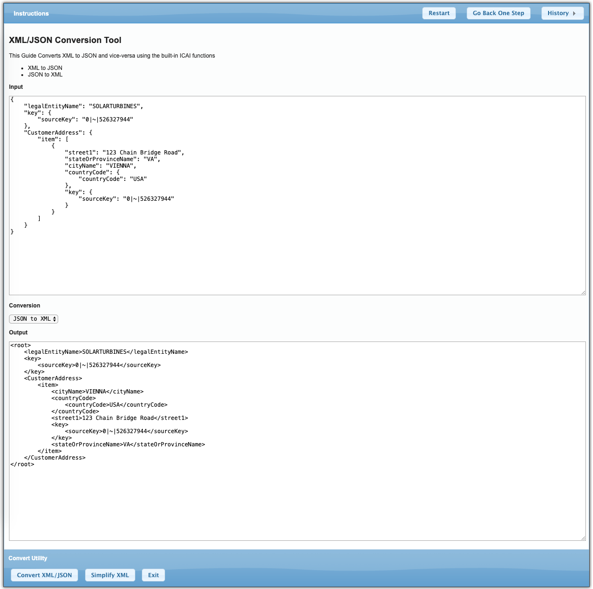
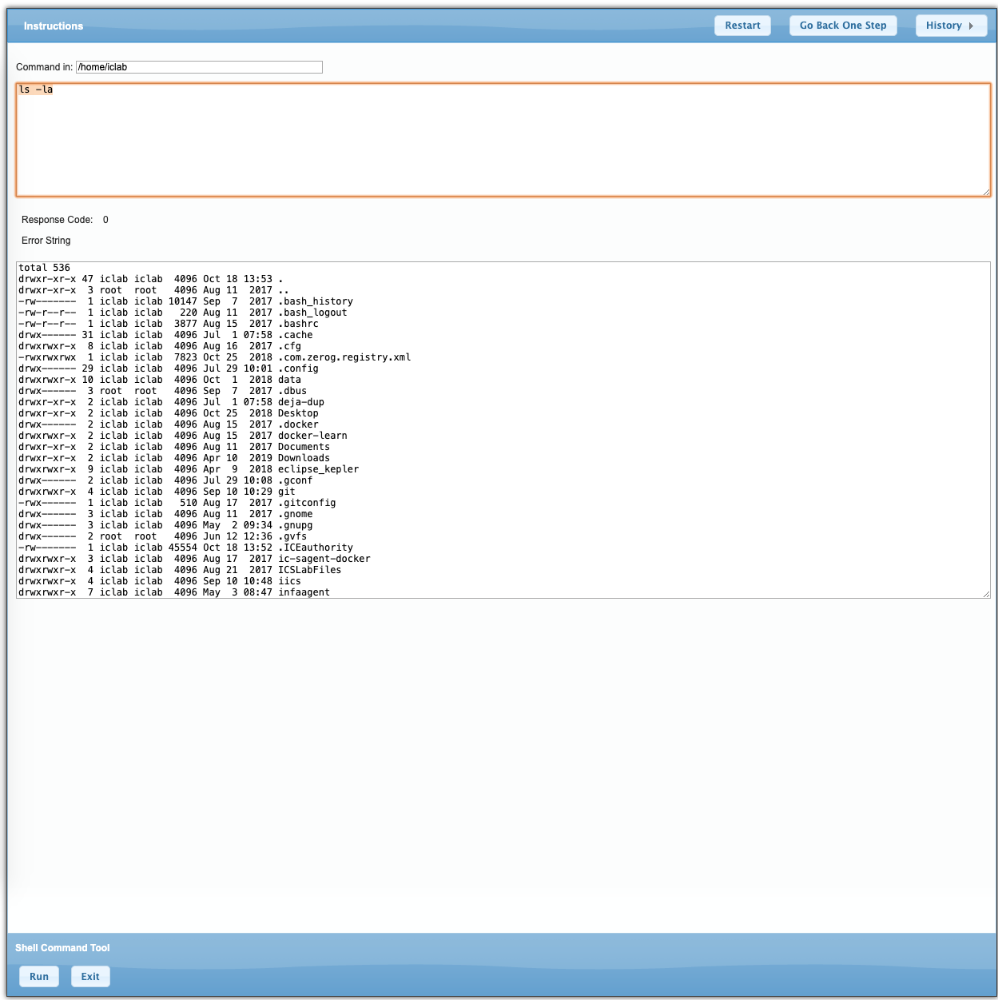
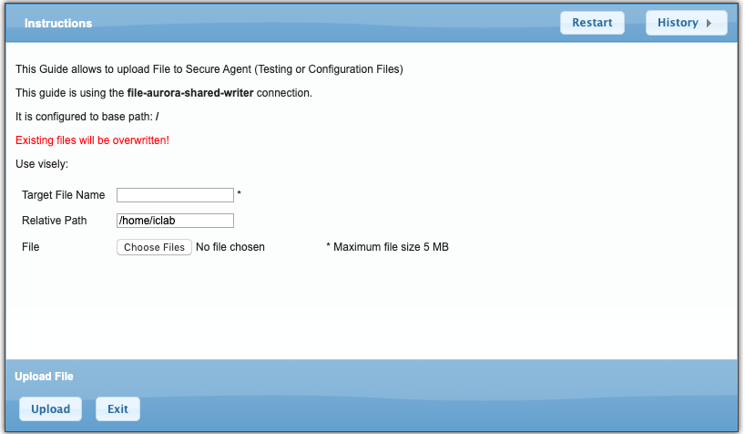
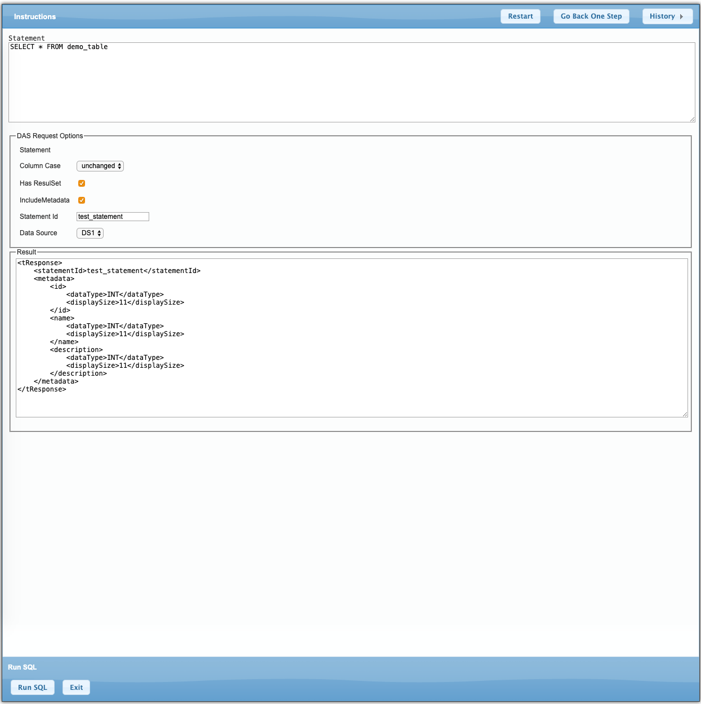
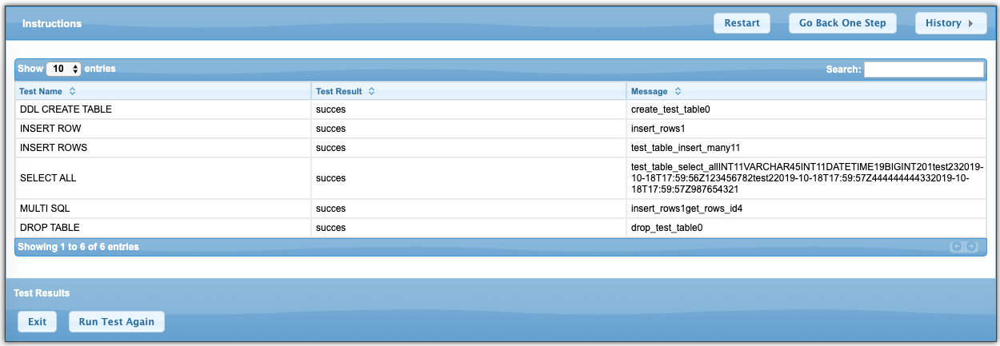

# Tools and Guides

<!-- TOC -->

- [Tools and Guides](#tools-and-guides)
    - [Conversion Utility](#conversion-utility)
    - [Admin Shell](#admin-shell)
    - [Upload File Utility](#upload-file-utility)
    - [DAS Tools](#das-tools)
        - [Invoke Statement](#invoke-statement)
        - [Test DAS Configuration](#test-das-configuration)

<!-- /TOC -->

## Conversion Utility

This guide allows to convert sample json to xml, xml to json or just simplify XML
This is useful when building Service Connectors, Creating Sample Data for tests or validating conversion of payloads using built-in functions

## Admin Shell

This guide allows to Run commands on Secure Agent. This can be useful when Developer or support needs to inspect secure agent or invoke commands remotely on Secure agent.

> Security Note: Enabling this guide and Shell Access service opens up the Secure agent for arbitrary command execution, you may want to restrict access to this guide only to selected Roles or Groups in IICS Platform

To run This guide you might need to adjust `Tools/Processes/SP-util-shell-curl-NA` Deployment properties and deploy it to desired secure agent.

 You will also need to enable System Shell Service in Application Integration Console

## Upload File Utility

This guide allows to upload Files to Secure Agent via File Writer, Which is useful in situations when Administrator or developer do not have access to Secure Agent File System.
In order to use this service you will need to set configuration and publish following objects

- `Tools/Connections/AgentFileWriter` - configure file Writer Deployment Agent and FileWriter event target's output base
- `Tools/Processes/SP-util-upload-agent` - configure target Deployment Agent

## DAS Tools

DAS tools is set of guides and Processes to test and invoke Data Access Service (DAS)  Arbitrary SQL. This tool can be used to tes and Invoke Arbitrary DAS Statements on Secure Agent.

In order to use this tool you have to deploy DAS Wrapper and configure Data Access Service on Secure Agent(s)

### Invoke Statement

### Test DAS Configuration

