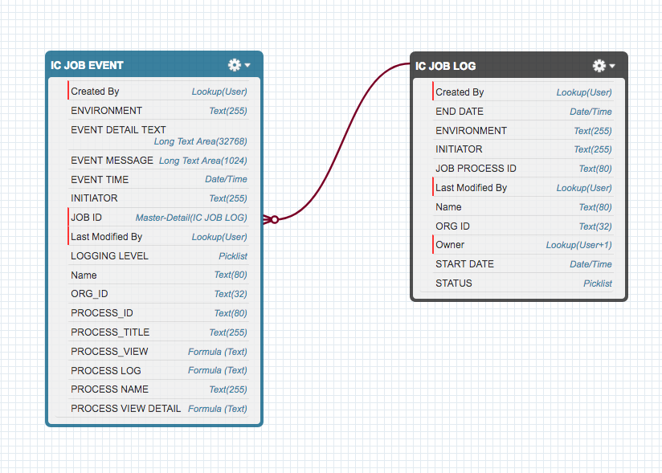
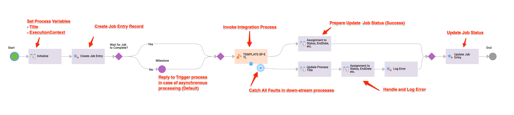

# IICS Logging Framework

<!-- TOC -->

- [IICS Logging Framework](#iics-logging-framework)
  - [Overview](#overview)
    - [IICS Logging Diagram](#iics-logging-diagram)
    - [Decision Matrix](#decision-matrix)
    - [Data Model](#data-model)
      - [Job Tracking Table - IC_JOB_LOG](#job-tracking-table---ic_job_log)
      - [Event Tracking table – IC_JOB_EVENTS](#event-tracking-table--ic_job_events)
    - [Job Tracking/Logging Bundle DB Setup](#job-trackinglogging-bundle-db-setup)
  - [Use of the Framework](#use-of-the-framework)
    - [Job Input Fields](#job-input-fields)
    - [Execution Context](#execution-context)
    - [Job Temp Fields](#job-temp-fields)
    - [Job Output Fields](#job-output-fields)
    - [Job Process Initialization](#job-process-initialization)
      - [Setting process Tile](#setting-process-tile)
      - [Set Execution Context](#set-execution-context)
  - [Creating Job Entry](#creating-job-entry)
  - [Invoke Main Integration Process](#invoke-main-integration-process)
  - [Error Handling](#error-handling)
      - [Example Sub-process Fault Event Handling](#example-sub-process-fault-event-handling)
    - [Logging Framework Processes](#logging-framework-processes)

<!-- /TOC -->

## Overview

Common use case while implement event-driven Integrations in IICS is a need to track Integration failures, milestones or other events that happen during Integration process execution.
ICAI does not keep persistent execution log logs for extended period of time. ICAI typically purges persisted process log information 1 day after completion or after fault. We might need to store tracking integration externally outside of process engine database.

> Note: We recommend to increase faulted process retention to 7 days with this pattern which allows more time to Support and administrators to diagnose the root cause of potential errors in the execution of integration processes

This project provides a set of pre-built Components allows to Design Integration processes leveraging Informatica Cloud best practices and design patterns.

Integration processes often share same characteristics:

- Processes can be batch or event-driven, near real time integrations.
- Processes can be both Stateful/Stateless (Business Process, Job, Composite Service)
- There might be need for unified external logging (Job Tracking) and error handling
- Integration Process may be composed from multiple steps/suppresses to simplify maintenance and enable re-use, in such case we might need to build layers to provide an end to end transactional tracking system.

The typical CAI integration often composed of several Layers as depicted on the following Image

### IICS Logging Diagram


Following this Design patter allows process execution to be easily tracked and monitored outside of runtime environment and improves error handling and speed of development as the components provided with this framework also significantly improve efficiency and ability to test and support implementation. This pattern also allows to build a robust unit and regression testing.

- Trigger - Inbound SOAP or REST message, Scheduled Process, JMS or other events such as a File Listener events
- Job process - records a Job tracking Information, handles subprocess reports, aggregates subprocess results in case of batch list processing, records job final status, records error events in case of unexpected job failure
- Integration Process - Performs actual integration tasks. This process can be composed of many chained processes, sub-processes and records events such as
  - INFO - Start/Finish or milestones
  - WARNING – Non Critical, non interrupting errors
  - ERROR – Critical, interrupting errors

Integration process and its children propagate critical errors upstream and all unexpected interrupting errors are handled by the main Job process
This framework is designed with different options to store the logging and tracking data. It uses simple data model composed of two related objects/entities

Framework can be  used with any relational Database and Salesforce as backend store for log entries. It currently provides a support for following back-ends

- MySQL
- MS SQL Server
- Oracle
- PostgreSQL
- Salesforce

### Decision Matrix

| Use SFDC when                                        | Use RDBMS When                                                                       |
|------------------------------------------------------|--------------------------------------------------------------------------------------|
| Salesforce is one of the Integrated Systems          | Salesforce is not an option or used by the organization                              |
| Relatively low volumes of jobs or transactions       | High Volume of logging data would be prohibitively expensive on SFDC                 |
| Want to keep all log information in the Cloud        | Risk of exceeding API limits on SFDC APIs                                            |
| Salesforce would be a primary UI to inspect log data | Prefer to store data on premise or Cloud DB hosted at same location as secure agents |
|                                                      | Already have existing Staging DB used by Secure agents or other integrations         |

### Data Model



#### Job Tracking Table - IC_JOB_LOG

| Field          | Type                 | Description                                                                                                                             |
| -------------- | -------------------- | --------------------------------------------------------------------------------------------------------------------------------------- |
| JOB_ID         | VARCHAR(36) NOT NULL | PK - uuid                                                                                                                               |
| JOB_PROCESS_ID | BIGINT               | Matching main job process ID (this process id is passed down to all sub processes as a parameter to allow tracking and event reporting) |
| JOB_NAME       | VARCHAR(255)         | Job Name, Usually Matches the JOB Process Name                                                                                          |
| START_DATE     | TIMESTAMP(6)         | Start Date                                                                                                                              |
| END_DATE       | TIMESTAMP(6)         | End Date                                                                                                                                |
| STATUS         | SMALLINT             | 1-Running, 2-Failed, 3-Completed                                                                                                        |
| INITIATOR      | VARCHAR(255)         | User Login Id (system user or actual user who started a job)                                                                            |
| ORG_ID         | VARCHAR(32)          | IICS Org ID                                                                                                                             |
| ENVIRONMENT    | VARCHAR(256)         | ICCS Environment (Resolved from URN Mapping )                                                                                           |

#### Event Tracking table – IC_JOB_EVENTS

| Field         | Type                 | Description                                                  |
| ------------- | -------------------- | ------------------------------------------------------------ |
| EVENT_ID      | VARCHAR(36) NOT NULL | PK GUID                                                      |
| JOB_ID        | VARCHAR(36)          | FK Job ID (main Job tracking ID)                             |
| PROCESS_ID    | BIGINT               | Process ID that Generated Event                              |
| PROCESS_NAME  | VARCHAR(256)         | Process Name                                                 |
| PROCESS_TITLE | VARCHAR(256)         | Process Title                                                |
| LOGGING_LEVEL | SMALLINT             | 1=INFO, 2=WARNING, 3=ERROR                                   |
| EVENT_TIME    | TIMESTAMP(6)         | Event Timestamp                                              |
| EVENT_MESSAGE | VARCHAR(1024)        | Event Message                                                |
| EVENT_DETAIL  | TEXT                 | Event Detail                                                 |
| ORG_ID        | VARCHAR(32)          | Org ID                                                       |
| ENVIRONMENT   | VARCHAR(256)         | IICS Environment (Resolved from URN Mapping )                |
| INITIATOR     | VARCHAR(255)         | User Login Id (system user or actual user who started a job) |

### Job Tracking/Logging Bundle DB Setup

Framework provides ICAI Guide and Process which can automate DB Configuration

You can also setup DB Manually or you need request DBA to create manage DB schema for yo, use following links to retrieve DDL/SQL examples to create/manage DB Schema for corresponding DB.
Following Table also provides links to pre-defined Informatica Data Access Service Request example to manage database Schema via [DAS][das_documentation] Service.

| Database                 | MSSQL                    | MySQL                    | PostgreSQL                 | Oracle                    |
| ------------------------ | ------------------------ | ------------------------ | -------------------------- | ------------------------- |
| DDL                      | [View][ddl_MSSQL]        | [View][ddl_Mysql]        | [View][ddl_Postgre]        | [View][ddl_Oracle]        |
| Create Schema DAS Script | [View][das_create_MSSQL] | [View][das_create_Mysql] | [View][das_create_Postgre] | [View][das_create_Oracle] |
| Reset Schema DAS Script  | [View][das_reset_MSSQL]  | [View][das_reset_Mysql]  | [View][das_reset_Postgre]  | [View][das_reset_Oracle]  |

## Use of the Framework

The Logging Framework Bundle Provides examples end Templates of the processes.
Most of integration processes will start with some Event as Depicted on [IICS Logging Diagram](#iics-logging-diagram)

Process Can Be started by various triggers

- IICS Scheduler
- Inbound Message on Cloud
- Inbound Message on Secure Agent
- JMS Message Listener
- Any of the File based Listeners (File Connector, FTP, AWS S3 Connector)
- Salesforce Eventing

Trigger Process is responsible to capture and react to specified events and start corresponding Job Process.
This process often runs job in asynchronous fashion but in some cases it runs Integration synchronously.
Synchronous invocation are more common within interactive composite services where caller service needs to receive result of event processing in rea-time synchronous pattern.
You should prefer asynchronous behaviors whenever overall response times exceed couple seconds or downstream service interactions have significant latency or demand retry patterns pfr increased reliability.

Example Event Handler With Asynchronous processing


Main job process is responsible to create Job Entry in the Logging DB It also often defines integration specific inbound parameters,
which are typically passed down to Integration (ETL) Sub process. See below image of such Job process.



All processes participation in this execution chain `Trigger > Job > Integration SubProcess` share a set of common input, temporary and output fields

### Job Input Fields

| Field               | Type                        | Description                               |
| ------------------- | --------------------------- | ----------------------------------------- |
| in_context          | $po:ProcessExecutionContext | Execution context Based on Process object |
| in_wait_to_complete | boolean                     | Defines whether the Job should wait for ETL process completion or run asynchronously                                          |

> Note that the Execution Context is used to pass following data to all downstream processes and is dynamically updated and passed down to all child processes in execution chain, 
> Note that there are typically tow context objects (in_context and tmp_context or out_context) tmp/out contexts are passed to child processes.

### Execution Context

This is a process Object Structure containing following fields, which allow us to track all Integration events within execution chain composed of one or many sub-processes against common Job ID

| Field           | Type    | Description                                              |
| --------------- | ------- | -------------------------------------------------------- |
| jobId           | string  | Job ID (GUID)                                            |
| mainProcessId   | integer | Main Process ID (typically Job ID or Trigger process ID) |
| parentProcessId | integer | Parent Process ID                                        |

### Job Temp Fields

| Field                        | Type                         | Description                                                                                                                 |
| ---------------------------- | ---------------------------- | --------------------------------------------------------------------------------------------------------------------------- |
| tmp_process_name             | string                       | Must match the actual process Name (it is used to generate process title and must be updated when using a Template process) |
| tmp_process_title            | string                       | Stores generated process Title                                                                                                                            |
| tmp_script_out               | string                       | Temporary output used when updating process Title or other temp outputs                                                                                                                            |
| tmp_CreateJobLogEventRequest | $po:CreateJobLogEventRequest | Used to create Log Events                                                                                                                            |
|                              |                              |                                                                                                                             |

### Job Output Fields

Job always returns out_context (its own execution context which contains process ID, And Job id)

| Field       | Type   | Description                                        |
| ----------- | ------ | -------------------------------------------------- |
| out_context | string |                                                    |
| Other       | Any    | Output parameters are specific to each integration |

### Job Process Initialization

All Job Processes follow the same pattern so minimal changes are required when you use provided Process Template.

Key steps of process initialization include

- setting process title
- creating execution context to return to parent or sent as an input to downstream processes.
- writing logging event to record start pf the integration

#### Setting process Tile

This is an important aspect of this design pattern and should be considered best practice. ICAI provides built-in function `ipd:setProcessTitle()`
which allows to update the process title stored as attribute of process in a process engine database.
This allows to add additional tracking information such as Job ID, Integrated object IDs or status
information to the process listing view and allows searching for related processes. This makes it easy
to find all processes participating in particular job execution or find all transactions to related object ID.

```xquery
let $p_name := $temp.tmp_process_name
let $pid_label := if (empty($output.out_context[1]/parentProcessId)) then ()
    else concat("pid:",$output.out_context[1]/parentProcessId)
let $job_label := if (empty($output.out_context[1]/jobId)) then ()
    else concat("job:",$output.out_context[1]/jobId)

(: We also recommend to add additional tracking information for Object Is:)

let $parts := ($p_name,$pid_label,$job_label)
return string-join($parts," ")
```

```xquery
ipd:setProcessTitle($temp.tmp_process_title)
```

> Note that the process title filed in process engine database has size limit of 255 characters and
> you need to ensure that the `ipd:setProcessTitle()` is called with title parameter shorter than 255 characters.
> Following example shows such trimming using `substring()` function when appending Fault error as a process status.
> Error message can have unknown size so we have to trim the title to fit target field in DB

```xquery
let $code  := $output.faultInfo[1]/code
let $error := $output.faultInfo[1]/reason
let $parts := ($temp.tmp_process_title,  "FAULTED:",$code, $error)
let $process_title := substring(string-join($parts, " "),1,255)
return ipd:setProcessTitle($process_title)
```

#### Set Execution Context

```xquery
let $pid := util:getProcessId()
return if (empty($input.in_context)) then
  <ProcessExecutionContext>
     <parentProcessId>{$pid}</parentProcessId>
     <mainProcessId>{$pid}</mainProcessId>
     <jobId>{util:generateUUID()}</jobId>
  </ProcessExecutionContext>
else
  <ProcessExecutionContext>
     <parentProcessId>{$pid}</parentProcessId>
     <mainProcessId>{$input.in_context[1]/mainProcessId}</mainProcessId>
     <jobId>{$input.in_context[1]/jobId}</jobId>
  </ProcessExecutionContext>
```

## Creating Job Entry

First step after process Initialization is to create a Job Entry.
It is a simple insert to Logging DB or create SFDC Object depending if you use DB or SFDC as storage provider for logs
Job entry is created via the `SP-IPaaS-Create-Job-Entry` or `SP-IPaaS-Update-Job-Entry-DB-{agentGroup}` process. 
Input is the `CreateJobLogEntryRequest` process object generated as follows.

```xquery
<CreateJobLogEntryRequest>
   <StartDate>{fn:current-dateTime()}</StartDate>
   <JobName>{$temp.tmp_process_title}</JobName>
   <ProcessId>{util:getProcessId()}</ProcessId>
</CreateJobLogEntryRequest>

```

## Invoke Main Integration Process

Main integration process is responsible to perform actual integration steps.
It must have at least Process Execution Context `in_context` input parameter which provides
necessary link to parent process and Job Id information.
Main Integration (ETL) often has integration specific parameters such as Object ID or
other parameters driving the integration logic or representing inbound data to be processed.
Follow provided [naming conventions][icai_namimg_conventions] to define such parameters,
prefer use of Process Objects to represent more complex data structures or lists of entries.

## Error Handling

Integration process can fail unexpectedly at any step of execution for different reasons.
This framework provides unified error handling mechanism to catch, handle and track all unexpected errors.

Process depicted in [Use oF the Framework Section](#use-of-the-framework) is demonstration the Catch all branch which  handles any unexpected error propagated from children Integration processes.
key steps of error handling is updating process title with failure and error message and REcording all the Fault/Error details to logging DB with ERROR logging level as shown below in code example

Job process Uses `SP-IPaaS-Create-Job-Event-Entry` Service to Create Event entry in the DB for corresponding job ID.

> Note that the `SP-IPaaS-Create-Job-Event-Entry` is invoked as a service not as a sub-process.
> This allows to set logging level on the deployed process and reduce process engine an log verbosity to minimal level when writing log entries to DB.
> We intentionally completely turn off the persistence of logger processes on Process Engine Console.
> If we would invoke logger as sub process logging level would be reset by cascading publish of sub-processes whenever we would publish Integration process which calls Logger.

#### Example Sub-process Fault Event Handling

```xquery
let $detail := $output.faultInfo[1]/detail
let $error_detail := switch (true())
        case ($detail/text()) return $detail/text()
        case ($detail/* instance of element()) return util:toXML($detail)
        default return string($detail)

let $pb_request := $input.in_StatusUpdate
return
<CreateJobLogEventRequest>
   <event_message>Job Fault</event_message>
   <event_time>{current-dateTime()}</event_time>
   <event_detail>Error Code: {$output.faultInfo[1]/code}
Error Reason: {$output.faultInfo[1]/reason}
Error Detail:
{$error_detail}
Request Data:
{ (: it might be useful to print out the input parameters of the process to log details :)
 for $field in $pb_request/*
 return
 concat(local-name($field),':',$field/text(),' ')
}

</event_detail>
   <process_id>{$output.out_context[1]/parentProcessId}</process_id>
   <logging_level>3</logging_level>
   <process_name>{$temp.tmp_process_name }</process_name>
   {$output.out_context }
   <process_title>{$temp.tmp_process_title}</process_title>
</CreateJobLogEventRequest>
```

### Logging Framework Processes

Logging Framework contains implementation of logger Service for DB and Salesforce which have matching functionality and same data model.
Both implementations use the same Process Object structures which encapsulate the Storage System interactions. Salesforce Implementation also
allows to invoke logging purely on the cloud process engine instances which has some performance benefits in case you implementing pure
cloud to cloud integration processes. The down-side of the salesforce use as backend for logging storage is that it may generate large
number of API calls to SFDC when you choose very granular verbose logging.

| Process                               | Location                                                                             | Description                                                                                           |
| ------------------------------------- | ------------------------------------------------------------------------------------ | ----------------------------------------------------------------------------------------------------- |
| SP-IPaaS-Create-Job-Entry-DB-NA       | Explore/Logging/Logger_Database_NA/SP-IPaaS-Create-Job-Entry-DB-NA.PROCESS.xml       | Generic logging process of jobs                                                                       |
| SP-IPaaS-Create-Job-Event-Entry-DB-NA | Explore/Logging/Logger_Database_NA/SP-IPaaS-Create-Job-Event-Entry-DB-NA.PROCESS.xml | Generic logging for events                                                                            |
| SP-IPaaS-Update-Job-Entry-DB-NA       | Explore/Logging/Logger_Database_NA/SP-IPaaS-Update-Job-Entry-DB-NA.PROCESS.xml       | Update Existing Job Entry withy a status and End Date                                                 |
| SP-IPaaS-Create-Job-Entry             | Explore/Logging/Logger_SFDC_Cloud/SP-IPaaS-Create-Job-Entry.PROCESS.xml              | Generic logging process of jobs                                                                       |
| SP-IPaaS-Create-Job-Event-Entry       | Explore/Logging/Logger_SFDC_Cloud/SP-IPaaS-Create-Job-Event-Entry.PROCESS.xml        | Generic logging for events                                                                            |
| SP-IPaaS-Update-Job-Entry             | Explore/Logging/Logger_SFDC_Cloud/SP-IPaaS-Update-Job-Entry.PROCESS.xml              | Generic logging process of jobs                                                                       |
| SP-IPaaS-Create-Job-Entry-NA          | Explore/Logging/Logger_SFDC_NA/SP-IPaaS-Create-Job-Entry-NA.PROCESS.xml              | Generic logging process of jobs                                                                       |
| SP-IPaaS-Create-Job-Event-Entry-NA    | Explore/Logging/Logger_SFDC_NA/SP-IPaaS-Create-Job-Event-Entry-NA.PROCESS.xml        | Generic logging for events                                                                            |
| SP-IPaaS-Update-Job-Entry-NA-1        | Explore/Logging/Logger_SFDC_NA/SP-IPaaS-Update-Job-Entry-NA.PROCESS.xml              | Generic logging process of jobs in SFDC                                                               |
| SP-Setup-Logging-DB                   | Explore/Logging/Setup/SP-Setup-Logging-DB.PROCESS.xml                                | Process manages theLogging framework Storage on  Supported Databases PostgreSQL, Oracle, MSSQL, MySQL |
| TEMPLATE-MP-Job-DB                    | Explore/Templates/Jobs_Logging_DB/TEMPLATE-MP-Job-DB.PROCESS.xml                     | Template for Main Job Processes                                                                       |
| TEMPLATE-SP-ETL-DB                    | Explore/Templates/Jobs_Logging_DB/TEMPLATE-SP-ETL-DB.PROCESS.xml                     | Template for Integration Sub-Process (SP) Demo                                                        |
| TEMPLATE-MP-Job-SFDC                  | Explore/Templates/Jobs_Logging_SFDC/TEMPLATE-MP-Job-SFDC.PROCESS.xml                 | Template for Main Job Processes                                                                       |
| TEMPLATE-SP-ETL-SFDC                  | Explore/Templates/Jobs_Logging_SFDC/TEMPLATE-SP-ETL-SFDC.PROCESS.xml                 | Template for Integration Sub-Process (SP)                                                             |

[ddl_MSSQL]: https://gist.githubusercontent.com/jbrazda/8e0be794bebf57965b4b810ee4ee1c67/raw/IICS_Logging_MSSQL.sql
[ddl_Mysql]: https://gist.githubusercontent.com/jbrazda/8e0be794bebf57965b4b810ee4ee1c67/raw/IICS_Logging_MySQL.sql
[ddl_Postgre]: https://gist.githubusercontent.com/jbrazda/8e0be794bebf57965b4b810ee4ee1c67/raw/IICS_Logging_PostgreSQL.sql
[ddl_Oracle]: https://gist.githubusercontent.com/jbrazda/8e0be794bebf57965b4b810ee4ee1c67/raw/IICS_Logging_Oracle.sql
[das_create_MSSQL]: https://gist.githubusercontent.com/jbrazda/a50b178232eb3d43ec3ca1e117e09cdf/raw/IICS_Logging_MDAS_CreateSchema_MSSQL.xml
[das_create_Mysql]: https://gist.githubusercontent.com/jbrazda/a50b178232eb3d43ec3ca1e117e09cdf/raw/IICS_Logging_MDAS_CreateSchema_MySQL.xml
[das_create_Postgre]: https://gist.githubusercontent.com/jbrazda/a50b178232eb3d43ec3ca1e117e09cdf/raw/IICS_Logging_MDAS_CreateSchema_PostgreSQL.xml
[das_create_Oracle]: https://gist.githubusercontent.com/jbrazda/a50b178232eb3d43ec3ca1e117e09cdf/raw/IICS_Logging_MDAS_CreateSchema_Oracle.xml
[das_reset_MSSQL]: https://gist.githubusercontent.com/jbrazda/a50b178232eb3d43ec3ca1e117e09cdf/raw/IICS_Logging_MDAS_ResetSchema_MSSQL.xml
[das_reset_Mysql]: https://gist.githubusercontent.com/jbrazda/a50b178232eb3d43ec3ca1e117e09cdf/raw/IICS_Logging_MDAS_ResetSchema_MySQL.xml
[das_reset_Postgre]: https://gist.githubusercontent.com/jbrazda/a50b178232eb3d43ec3ca1e117e09cdf/raw/IICS_Logging_MDAS_ResetSchema_PostgreSQL.xml
[das_reset_Oracle]: https://gist.githubusercontent.com/jbrazda/a50b178232eb3d43ec3ca1e117e09cdf/raw/IICS_Logging_MDAS_ResetSchema_Oracle.xml
[das_documentation]: https://network.informatica.com/onlinehelp/activevos/current/index.htm#page/bb-av-designer/Data_Access_Service.html
[icai_namimg_conventions]: https://github.com/jbrazda/Informatica/blob/master/Guides/InformaticaCloud/naming_conventions.md#icai-naming-conventions
